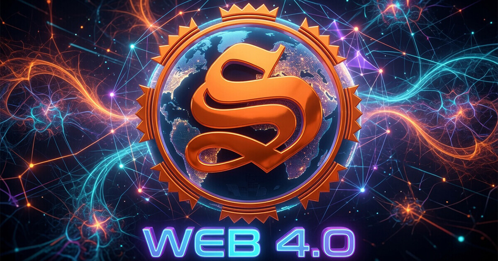
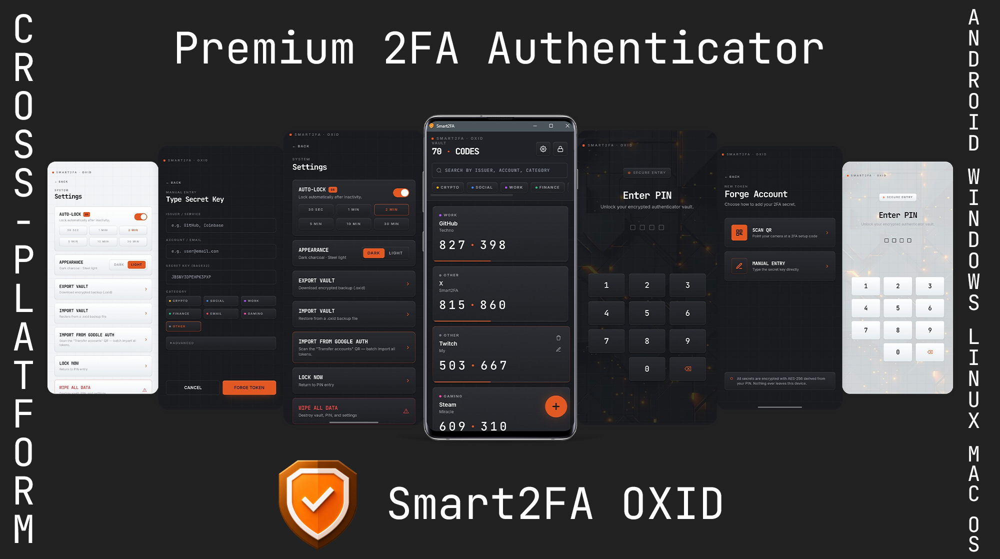

<!--
<div>
    <a href="https://github.com/technologiespro">
        
        
    </a>
</div>
-->


<!--START_SECTION:waka-->


**🐱 My GitHub Data** 

> 📦 1.4 MB Used in GitHub's Storage 
 > 
> 🏆 513 Contributions in the Year 2026
 > 
> 🚫 Not Opted to Hire
 > 
> 📜 269 Public Repositories 
 > 
> 🔑 161 Private Repositories 
 > 
**I'm a Night 🦉** 

```text
🌞 Morning                4046 commits        ⬛⬛⬛⬜⬜⬜⬜⬜⬜⬜⬜⬜⬜⬜⬜⬜⬜⬜⬜⬜⬜⬜⬜⬜⬜   13.47 % 
🌆 Daytime                7314 commits        ⬛⬛⬛⬛⬛⬛⬜⬜⬜⬜⬜⬜⬜⬜⬜⬜⬜⬜⬜⬜⬜⬜⬜⬜⬜   24.35 % 
🌃 Evening                9081 commits        ⬛⬛⬛⬛⬛⬛⬛⬛⬜⬜⬜⬜⬜⬜⬜⬜⬜⬜⬜⬜⬜⬜⬜⬜⬜   30.24 % 
🌙 Night                  9593 commits        ⬛⬛⬛⬛⬛⬛⬛⬛⬜⬜⬜⬜⬜⬜⬜⬜⬜⬜⬜⬜⬜⬜⬜⬜⬜   31.94 % 
```
📅 **I'm Most Productive on Wednesday** 

```text
Monday                   4585 commits        ⬛⬛⬛⬛⬜⬜⬜⬜⬜⬜⬜⬜⬜⬜⬜⬜⬜⬜⬜⬜⬜⬜⬜⬜⬜   15.27 % 
Tuesday                  4300 commits        ⬛⬛⬛⬛⬜⬜⬜⬜⬜⬜⬜⬜⬜⬜⬜⬜⬜⬜⬜⬜⬜⬜⬜⬜⬜   14.32 % 
Wednesday                4715 commits        ⬛⬛⬛⬛⬜⬜⬜⬜⬜⬜⬜⬜⬜⬜⬜⬜⬜⬜⬜⬜⬜⬜⬜⬜⬜   15.70 % 
Thursday                 4122 commits        ⬛⬛⬛⬜⬜⬜⬜⬜⬜⬜⬜⬜⬜⬜⬜⬜⬜⬜⬜⬜⬜⬜⬜⬜⬜   13.72 % 
Friday                   4226 commits        ⬛⬛⬛⬛⬜⬜⬜⬜⬜⬜⬜⬜⬜⬜⬜⬜⬜⬜⬜⬜⬜⬜⬜⬜⬜   14.07 % 
Saturday                 3566 commits        ⬛⬛⬛⬜⬜⬜⬜⬜⬜⬜⬜⬜⬜⬜⬜⬜⬜⬜⬜⬜⬜⬜⬜⬜⬜   11.87 % 
Sunday                   4520 commits        ⬛⬛⬛⬛⬜⬜⬜⬜⬜⬜⬜⬜⬜⬜⬜⬜⬜⬜⬜⬜⬜⬜⬜⬜⬜   15.05 % 
```


🤖 **AI Coding This Week** 

```text
⏱ AI Coding Time: 2 hrs 58 mins (13.15%)

✍️ 19,591 lines written by AI, 3,258 lines written by hand (85.74% AI-written)

🔤 902,253 Input Tokens, 339,835 Output Tokens

💵 $7.80 Estimated AI Cost This Week

🧠 24 AI Sessions, 31 AI Prompts

Mimo                     19,591 lines        ⬛⬛⬛⬛⬛⬛⬛⬛⬛⬛⬛⬛⬛⬛⬛⬛⬛⬛⬛⬛⬛⬛⬛⬛⬛   100.00 % 
Opencode-Cli             0 lines             ⬜⬜⬜⬜⬜⬜⬜⬜⬜⬜⬜⬜⬜⬜⬜⬜⬜⬜⬜⬜⬜⬜⬜⬜⬜   00.00 % 

🔎 AI Coding Insights:
🤖 AI-Driven — 85.74% of written lines came from AI
📚 Verbose Prompter — average 3,743 characters per prompt
🎯 One-Shot Prompter — average 1 prompts per session
🚀 High AI Trust — 14.42% of changed lines were hand-edited
```


 Last Updated on 31/07/2026 00:57:37 UTC
<!--END_SECTION:waka-->


<table style="border:none;border:0;">
<tr style="border:none;border:0;">
<td style="border:none;border:0;width:50%;vertical-align:top;">
<figure>
<a href="https://smartholdem.io">
  
<figcaption>Real WEB 4.0</figcaption></a>
</figure>
</td>
 <td style="border:0;width:50%;vertical-align:top;">
<figure>
<a href="https://xbts.io">
  
<figcaption>XBTS DEX Exchange</figcaption>
</a>
</figure>
</td>
</tr>
</table>


<figure>
<a href="https://github.com/technologiespro/smart2fa/releases">
  
</a>
</figure>


